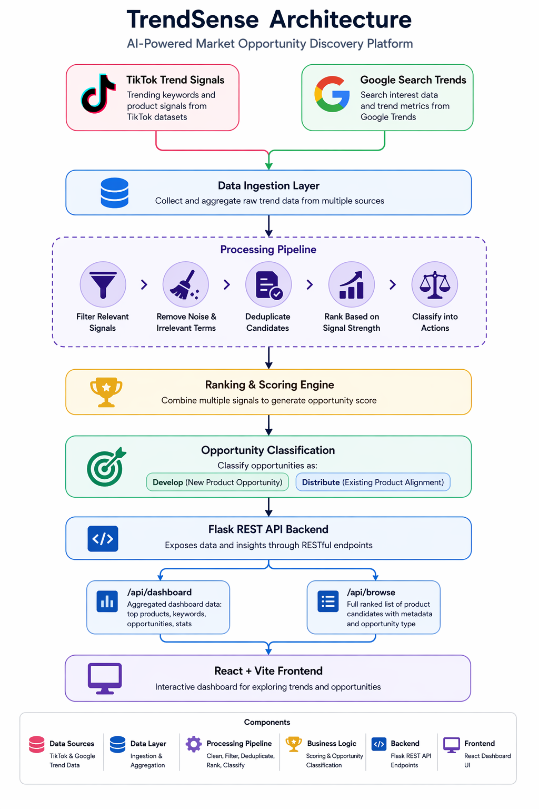
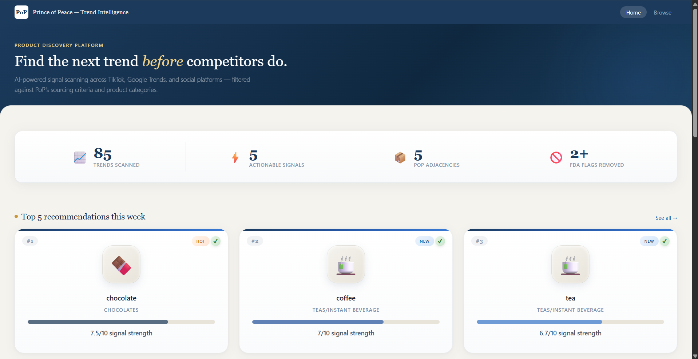
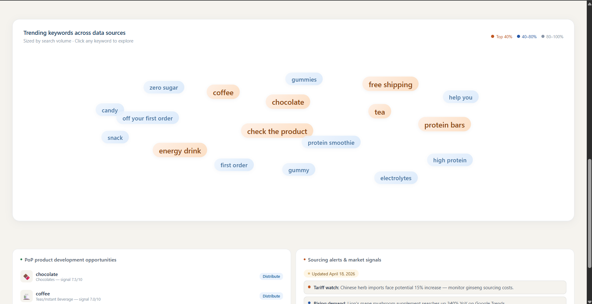
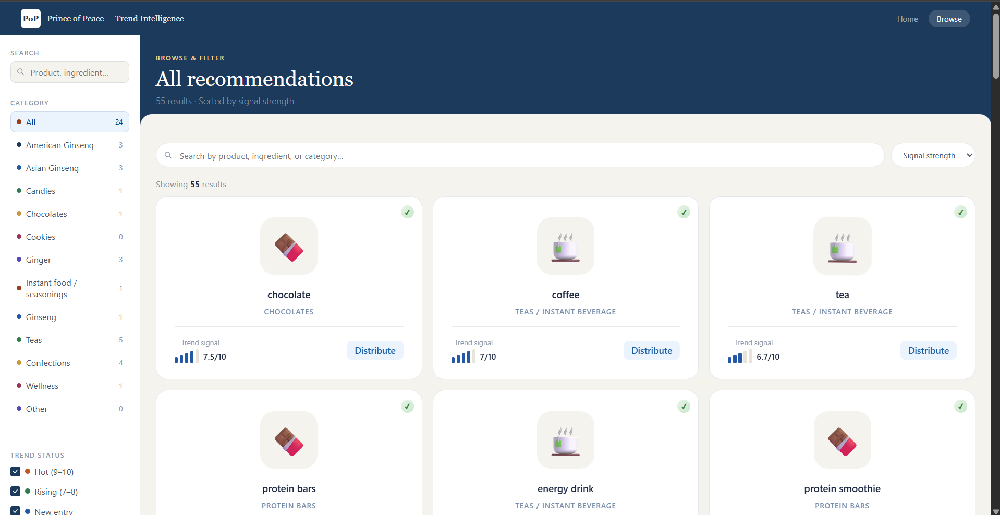

# 🚀 TrendSense: AI-Powered Market Opportunity Discovery Platform
Discover emerging product opportunities by combining TikTok trend signals with Google search data — enabling faster, data-driven product decisions.


## Overview
TrendSense is a full-stack data-driven platform that identifies and ranks emerging product opportunities by analyzing multi-source trend signals. By combining TikTok keyword trends with Google search interest, the platform helps businesses validate demand and decide whether to develop new products or distribute existing ones.

This project was built as part of Hack the Coast 2026, with a focus on solving real-world product discovery challenges for consumer brands.


## 📌 Problem
Businesses—especially small and mid-sized brands—struggle to identify emerging product trends early enough to act on them.

Key challenges include:
- Trend signals are fragmented across platforms (TikTok, Google, etc.)
- Raw data is difficult to interpret without technical expertise
- Decisions are often reactive rather than data-driven
- Lack of a centralized system to validate and prioritize opportunities

As a result, companies miss early-stage opportunities or invest in low-demand products.


## 💡 Solution
TrendSense aggregates and processes trend data from multiple sources to generate actionable product insights.

The platform:
- Combines TikTok keyword signals with Google search trends
- Cleans and filters raw trend data
- Ranks opportunities based on signal strength and relevance
- Classifies opportunities into:
  - Develop → New product opportunity
  - Distribute → Existing product/category alignment
- Presents results through an interactive dashboard

This enables faster, data-backed decision-making for product strategy.


## 🧩 Key Features
- 📊 Multi-source trend aggregation (TikTok + Google Trends)
- 🧠 Opportunity ranking and scoring engine
- 🔍 Intelligent filtering of data that does not match minimum criteria
- ⚖️ Business decision classification (Develop vs Distribute)
- 🖥️ Interactive dashboard for exploration and insights
- 🔗 REST API backend powering frontend UI


## 🏗️ Architecture

### High-Level Flow


### Components
- Processing Pipeline  
  Cleans, filters, and standardizes raw signals to produce high-quality inputs for ranking.
- Ranking & Scoring Engine  
  Ranks opportunities based on combined signal strength (e.g., frequency, growth, consistency) and generates an overall opportunity score to identify actionable product opportunities.
- Opportunity Classification Logic  
  Classifies ranked opportunities into actionable categories:
  - Develop → New product opportunities
  - Distribute → Existing product alignment opportunities
- Backend (Flask)  
  Handles API requests and exposes processed data via endpoints `/api/dashboard` and `/api/browse`.
- Frontend (React + Vite)  
  Displays dashboard views, ranked opportunities, and keyword insights


## 📊 Data Sources
- TikTok Trend Signals  
  - Derived from curated datasets capturing early-stage consumer interest.
- Google Search Trends  
  - Used to validate demand and measure search interest over time.

*Note: A combination of real and curated datasets was used for this hackathon prototype.*


## 🧱 API Endpoints
**GET /api/health**  
Simple health check to confirm the backend is running.
```
{
  "status": "ok"
}
```

**GET /api/dashboard**  
Returns aggregated insights for the main dashboard view, including:
- Top products (ranked opportunities)
- Trending keywords
- Opportunity highlights
- Summary stats

**GET /api/browse**  
Returns the full ranked list of product opportunities.
- Combines TikTok + Google Trends data
- Filters non-food items
- Deduplicates and ranks by signal score

Each item includes:
- Name, category, score
- Opportunity type (Develop / Distribute)
- Approval status, ingredients, metadata


## 🏗️ Tech Stack
Frontend
- React
- Vite

Backend
- Python
- Flask

Data
- Google Trends
- TikTok datasets


## 🎯 How It Works
1. Collect trend data
2. Clean and filter
3. Calculate relevant signals
4. Rank opportunities
5. Classify (Develop vs Distribute)
6. Serve via APIs built in Flask
7. Display in dashboard


## ⚙️ Setup Instructions
**Prerequisites**
Make sure you have installed
- Python 3.9+
- Node.js (v16+ recommended)
- npm

**Initial setup**
Create and activate a virtual environment
`pip install -r requirements.txt`

**Backend**  
`cd backend`    
`python app.py`  

Backend will run at `http://127.0.0.1:5000`

**Frontend**  
`cd frontend`  
`npm install`  
`npm run dev`

Frontend will run at `http://localhost:5173/`

The frontend is configured to proxy API requests to the Flask backend. Make sure the backend is running before starting the frontend.


## 🧠 Challenges and Learning
- Cleaning and filtering trend data
- Designing ranking logic across multiple sources
- Aligning cross-platform signals (TikTok vs Google)


## 🚀 Future Improvements
- Real-time data ingestion
- ML-based trend prediction
- Cloud deployment
- Improved UI/UX


## 📷 Demo/Screenshots
 
